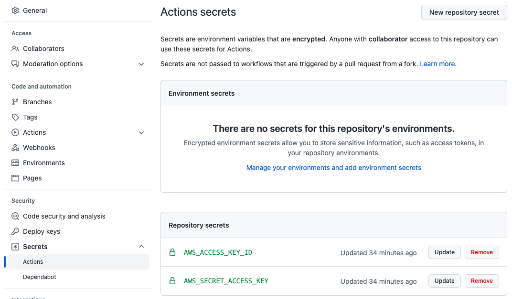

# Elastic Beanstalk Cloud Server

Elastic Beanstalk lets you deploy web apps from a variety of environments quickly and easily with automated tools.

## How To

From the terminal, use these commands to spin up an eb instance of you webapp.

    cd my-node-app
    eb init
    eb create
    eb deploy

## Adding Secrets

To add secrets for GitHub Actions to access, you can do so in Settings.

